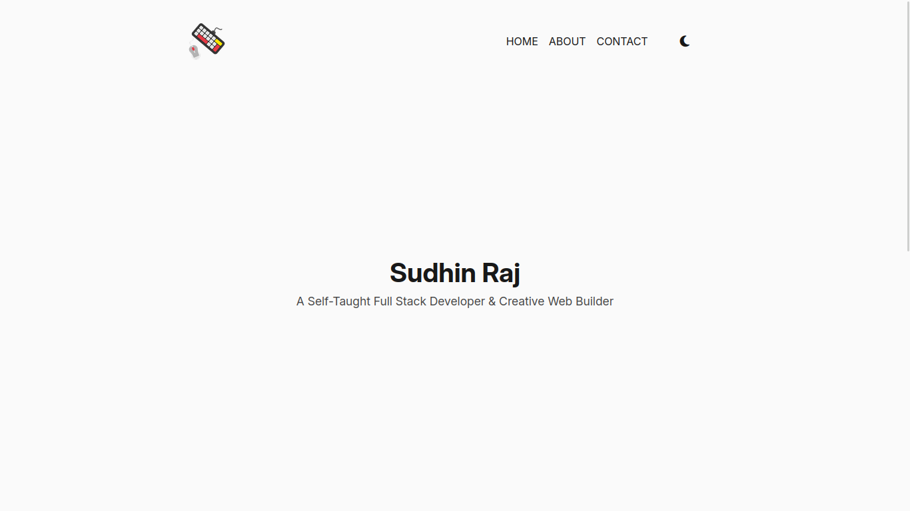

# 🌐 Minimalist Portfolio

[](https://github.com/rjsudhin/minimalist-portfolio)
[](https://github.com/rjsudhin/minimalist-portfolio)
[](https://github.com/rjsudhin/minimalist-portfolio/stargazers)
[](./LICENSE)

A clean, responsive, and minimal personal portfolio website built using **HTML**, **CSS**, and **JavaScript**. This project showcases your personal information, social links, and includes a dark/light theme toggle for a modern touch.

---

## 🔗 📸 Previewm && Live Demo

](https://rjsudhin.github.io/minimalist-portfolio/)
 <!-- You can replace this with an actual screenshot -->

---

🔗 [Live Demo](https://rjsudhin.github.io/minimalist-portfolio/)


## 🧠 Features

- ⚡ Minimal and clean design
- 🌙 Dark/Light theme toggle (with icon)
- 🎨 Responsive layout for all screen sizes
- 🌐 Social media link buttons
- 📱 Mobile-friendly hamburger menu
- 🎯 Font Awesome icons integrated
- 🔥 Easy to customize and extend

---

## 🛠️ Tech Stack

- HTML5
- CSS3 (with `clamp()` and modern responsiveness)
- JavaScript (Vanilla)
- Font Awesome (for icons)

---

## 🚀 Getting Started

1. **Clone the repository**

```bash
git clone https://github.com/rjsudhin/minimalist-portfolio.git
cd minimalist-portfolio

🧑‍💻 Author

Sudhin Raj B S

📄 License

This project is licensed under the MIT License.